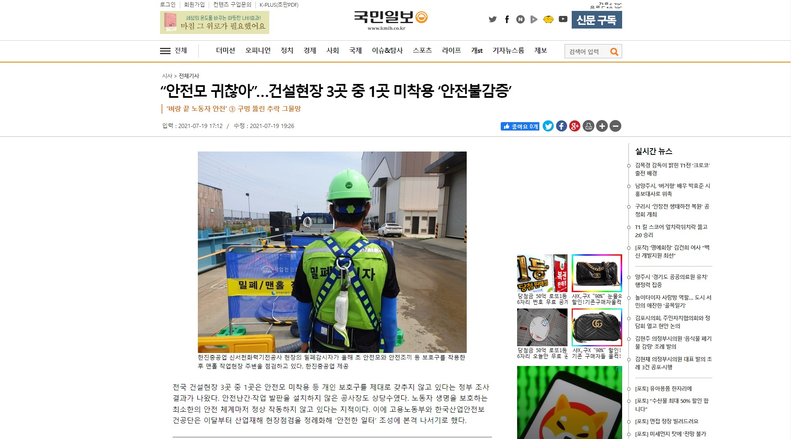
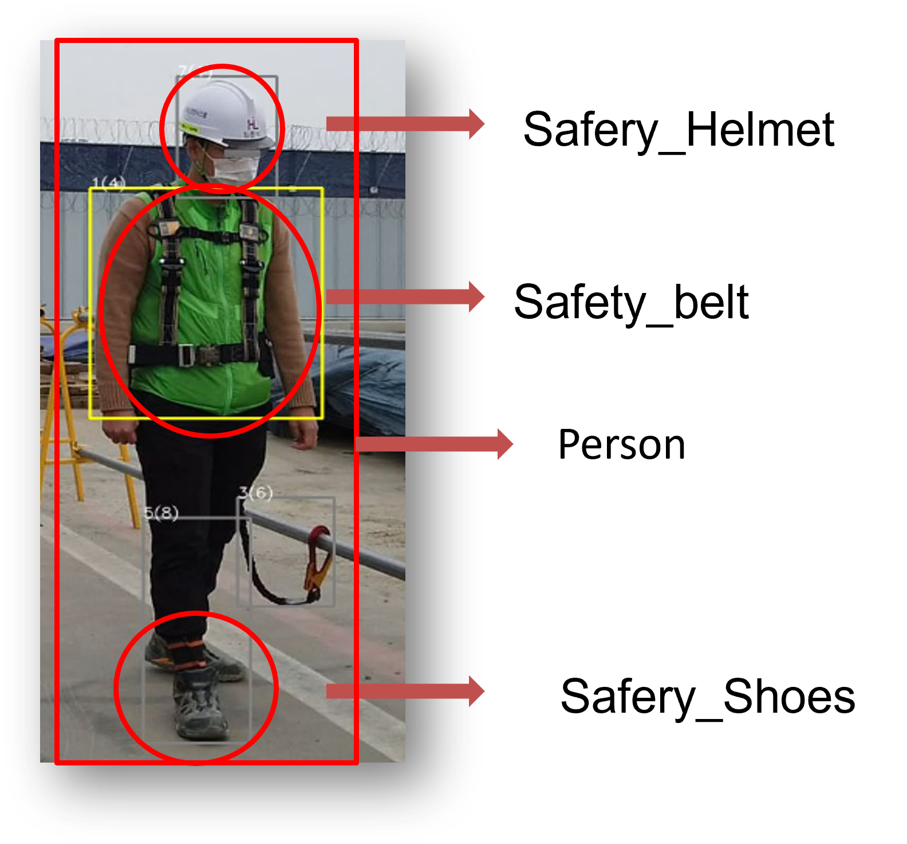
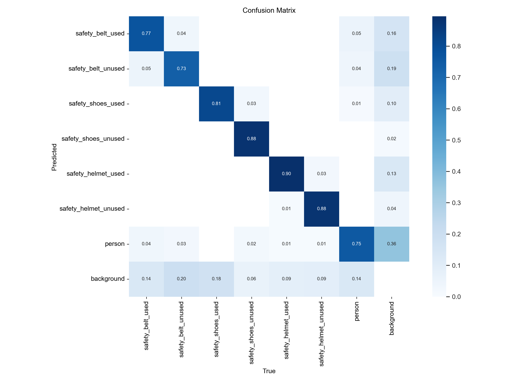
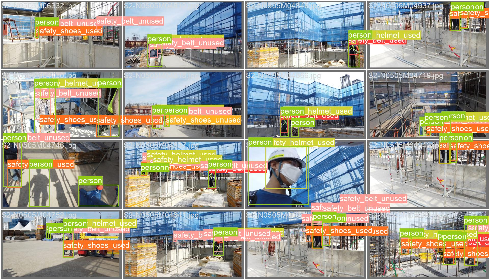
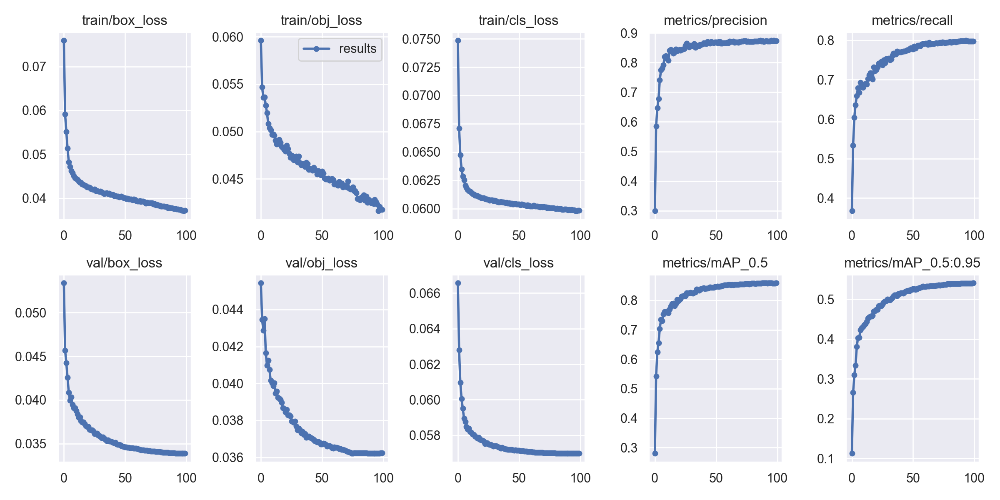
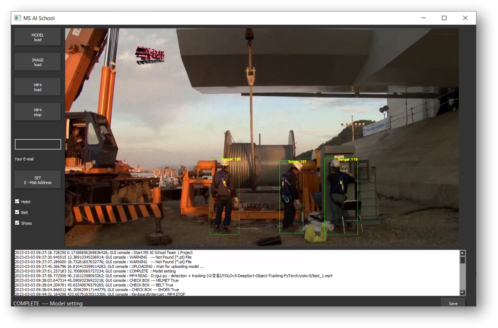
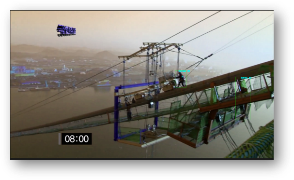

# PPE Detection for Construction Site Safety using YoloV5

## Introduction

- There are many safety accidents without wearing safety equipment (safety helmets, seat belts, safety shoes, etc.) at the construction site until 2023, and a pilot company has been selected and implemented since February 2022. 

- It was seen that an employee who did not wear safety equipment at the construction site was notified to the construction site manager when he was found not wearing it for a certain period of time on CCTV. 
- Therefore, we are working on the project with the goal of making the current Object Detection class and practice similar to the actual practice.

- references:

    - [reference_1](http://news.kmib.co.kr/article/view.asp?arcid=0016070557&code=61121111&cp=nv),
    [reference_2](https://newsis.com/view/?id=NISX20230127_0002172017),
    [reference_3](https://www.hankyung.com/society/article/202302032530Y)

---

- Number of participants: 5 people

- Technology Stack: Python, ,Pytorch(ObjectDetection), Pyqt5, Yolov5, Yolov7, Deepsort, MMdetection

- My Role: Data Collection and Purification (Labeling and Bounding Box using CVAT), Data Segmentation, Model Training, GUI Implementation using Pyqt5 and Tracking Connection using Deepsort.

---

- There are 7 classes to detect from the dataset:
    
    

    
    - 'Safety_Belt', 'No_Safety_Belt', 'Safety_Shoes', 'No_Safety_shoes', 'Safety_helmet', 'No_Safety_helmet', 'Person'

## Results

### 1. Yolov5
The training of Yolov5n model was done for 100 epochs and wa completed in about 5 hours. After training, we get the following results:

VM Environment

GPU : Tesla V100, Memory : 112GB, CPU : Intel(R) Xeon(R) CPU E5-2690 v4 @ 2.60GHz 

  

### Data set
|Type|Images|
|:----:|:----:|
|Train|11,495|
|Valid|1,437|

- Train image data is 11,495 and Valid image data is 1,437.

### Annotation Information(Bounding Box)
|Label|Train|Valid|
|:----:|:----:|:----:|
|Safety_Belt|7,841|1,006|
|No_Safety_Belt|14,820|2,111|
|Safety_Shoes|8,979|1,156|
|No_Safety_Shoes|6,607|881|
|Safety_Helmet|13,747|2,480|
|No_Safety_Helmet|6,474|811|
|Person|25,855|3,235|
|Total|84,323|11,680|

- When determining the number of bounding boxes, 84,323 bounding boxes for Train and 11,680 bounding boxes for Valid.

- references:

    - [AI 허브(공사 현장 안전장비 인식 이미지) ​](https://aihub.or.kr/aihubdata/data/view.do?currMenu=116&topMenu=100&aihubDataSe=ty&dataSetSn=163)
    - [roboflow(Personal Protective Equipment - Combined Model)​](https://universe.roboflow.com/roboflow-universe-projects/personal-protective-equipment-combined-model/browse?queryText=class%3A%22NO-Safety+Vest%22&pageSize=50&startingIndex=500&browseQuery=true​)
    - [roboflow(Hard Hat Workers Dataset) - 안전모 미착용​](https://public.roboflow.com/object-detection/hard-hat-workers/2​)
    - [roboflow(clothes detect) - 안전조끼 미착용​​](https://universe.roboflow.com/zhang-ya-ying/clothes-detect-fevqm/dataset/5​)
    - [roboflow(site2)​](https://app.roboflow.com/changwoo-kim-vvfty/site2/browse?queryText=&pageSize=50&startingIndex=0&browseQuery=true​​)
    - [roboflow(whole_dataset) - 안전화 미착용​​](https://universe.roboflow.com/business-qcddc/whole_dataset/dataset/4​​)

### 1.1. Yolov5 & Yolov7 result Table
|Model|Hyperparameter|Batch_size|Epochs|optimizer|mAP0.5|mAP0.5-0.95|
|:--:|:--:|:--:|:--:|:--:|:--:|:--:|
|Yolov5n|Hyp.scratch-low|16|100|SGD|0.83782|0.49619|
|Yolov5n|Hyp.scratch-low|16|100|AdamW|0.81|0.469|
|Yolov5s|Hyp.scratch-high|84|100|SGD|0.86399|0.53363|
|Yolov5l|Hyp.scratch-high|16|30|SGD|0.8715|0.55632|
|Yolov5m|Hyp.scratch-low|32|100|SGD|0.88586|0.5667|
|Yolov5x|Hyp.scratch-med|16|100|Adam|0.88726|0.57239|
|Yolov7|Hyp.scratch.p5|16|200|SGD|0.933|0.598|

- When we looked at Yolov5's model with n, s, l, m, x, and Yolov7, we found that mAP 0.5~0.95 did not have more than 0.6 values.

### 1.2. Yolov5 of confusion_matrix result(Yolov5x):

### 1.3. Yolov5 of Val_batch_label result(Yolov5x):

- This is the image when I trained with Train and printed out the image of Validation.

### 1.4. Yolov5 of result(Yolov5x):

- In mAP 0.5 it has a value of more than 0.8, but in mAP 0.5 to 0.95, when 100 epochs were turned, it was found to converge from 0.55 to 0.6.
- So even when we turned Yolov7 200 epochs, we could see that it converges below 0.6. I've only watched 1-Stage, so I'm trying to see if I get different results when I watch 2-Stage on MMdetection. We're also figuring out if the data is weird.

### 1.5. Yolov5 of Output(Yolov5x):

- Implementation Features
    - Explore other janggu objects within the person object (check whether a person wears janggu or not)
       - Person Make sure that the center value of another object is in the bounding box
    - Object check function that you want to recognize (the program user selects whether to wear the right equipment for the workplace)
    - Email notification service when not wearing it on the screen for a certain period of time or more

- The Yolov5 pt file and the bounding box tracked people with Deepsort are implemented by calculating IOU, wearing a safety helmet, seat belt, and safety shoes using the GUI to indicate whether it is safe or not, and sending an e-mail to the manager for a certain period of time. 

- Have the operator send an e-mail message to the administrator when safety equipment is not worn for a certain period of time.

- When you send an e-mail, capture the person who is not wearing it as shown in the picture above and send it together by e-mail.

<!-- ### 2. Yolov7 -->
