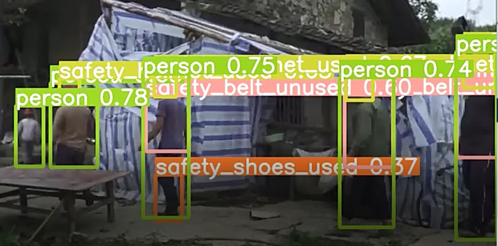

# PPE Detection for Construction Site Safety using YoloV5

## Introduction

- There are 7 classes to detect from the dataset:

- 'safety_belt_used', 'safety_belt_unused', 'safety_shoes_used', 'safety_shoes_unused', 'safety_helmet_used', 'safety_helmet_unused', 'person'

## Results

The training of Yolov5n model was done for 100 epochs and wa completed in about 5 hours. After training, we get the following results:

### confusion_matrix result:

### Val_batch_label result:

### result:

### Output:
