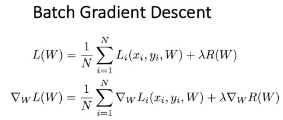

# 2022년 12월 25일 
# 인공신경망 이론 학습(2)

## 1. optimization

- **Optimization**은 **Loss를 최소화하는 W를 찾는 것**이며, 예로들면 높은 곳에서 낮은 곳으로 가는 길의 최단경로(?)를 찾아가는 것과 유사하다고 볼 수 있다.

- Linear regression 등의 간단한 모델에서는 간단한 미분을 통해 최소 Loss를 가지는 W를 찾을 수도 있지만, 복잡해진다면 최적의 W를 찾는 다는 것은 어려운 수 있다. 따라서 **특정한 공식으로 최적의 W를 찾는 것보다는 최소의 Loss를 가지도록 W를 변경해가면서 찾아준다.**

1. Batch Gradient Descent
    
   - Loss가 각 데이터의 합으로 이루어져 있는 거 처럼 Gradient도 각 데이터의 합으로 이루어져 있다.   

2. SGD
    - 모든 데이터에 대해서 Gradient와 Loss를 구하기 보다는 표본 데이터를 추출해서 일부만 가지고 구한다.

3. SGD + Momentum
    - **순수한 SGD를 사용하기 보다는 조금 변형시켜서 사용하는데** 대표적인 방법들 중 하나가 SGD + Momentum으로 Linear 모델 말고는 딥러닝 모델에서도 많이 쓰이는 방법

4. AdaGrad
   - **AdaGrad는 '각각의' 매개변수에 '맞춤형'값을 만들어 준다.** 

5. Adam
    - momentum과 AdamGrad를 융합한 기법이 Adam이다.
    - 두 방법의 이점을 조합했으므로 매개변수 공간을 효율적을 탐색해줄 것이라 기대하며, 하이퍼파라미터의 **'편향 보정'**이 진행된다는 점도 Adam의 특징